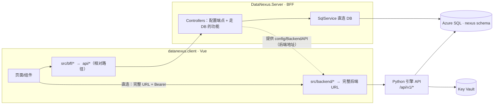

# Data Nexus 前端设计（UI Design）

> 配套文档：`data_nexus_design.md`（后端/引擎设计）。本文件只讲**前端如何呈现整个系统**，以及前端与 BFF、后端的通信方式。
> register：本文档随实现更新，保持与代码一致。

---

## 1. 目标：把「打通语义与数据」变成看得见的操作

系统的核心体验是**一句话提问 → 跨源取数 → 答案 + 出处**。前端要让这件事直观、可信、可管理：

- **敢问**：一个干净的提问台，像聊天一样问业务问题。
- **敢信**：每个数字都能点开看「来自哪个库 / 哪张表 / 什么口径」（出处）。
- **可管**：本体（业务名词）、数据源、LLM 都能在界面上注册、查看、维护。
- **可查**：每一次提问都留痕，能回看当时的问题、查询计划、结果与出处。

---

## 2. 技术架构：Vue 客户端 + .NET BFF + 共享库

沿用 AIBI 前端的成熟结构（`frontend/DataNexus/`）：

| 项目 | 技术 | 职责 |
|---|---|---|
| `datanexus.client` | Vue 3 + TS + Element Plus + Vite | 界面与交互；MSAL 登录；调用 `api/*` |
| `DataNexus.Server` | ASP.NET Core（BFF） | 托管 SPA；校验 JWT；**直连 DB** 做元数据/历史读写；**代理**到 Python 后端 |
| `DataNexus.Library` | .NET 类库 | 共享服务：`HttpClientService`（调后端）、`SqlService`（连库）、鉴权、配置 |

### 2.1 两条通信通道（关键设计）

> **前端有自己的 .NET BFF。和数据库的操作直接在 BFF 执行；要和真正的后端（Python 引擎）沟通，则通过 API。**

- **Vue → BFF**（`src/bff/*`，相对 `api/<path>`）：配置端点（`config/BackendAPI`、`config/MSAL`）+ BFF 原生、走 DB 的功能。dev 用 vite 代理 `^/api`→BFF，生产同源。
- **Vue → Python 后端（直连）**（`src/backend/*`）：先从 BFF 拿到后端 BaseUrl（`config/BackendAPI`），再用**完整 URL** 直接打后端 `/api/v1/*`，请求带 MSAL `Authorization: Bearer`。后端用 `require_auth` 验 JWT，并对 SPA 源开 CORS。用于跑引擎（`/ask`）、编译、凭据等。
- **BFF → DB（直连）**：`SqlService` 读写 `nexus` schema 的元数据（concepts / bindings / resolvers / llms）与运行历史（runs / run_steps）。

### 2.2 前端目录约定（镜像 AIBI）

- `src/backend/*.ts` —— **直连 Python 后端**：`backendUrl(path)`（在 `bff/Config.ts`）用 `config/BackendAPI` 的 BaseUrl 拼成完整 URL，`service` 带 Bearer 直接请求。例：`Ask.ts`、`Credential.ts`。
- `src/bff/*.ts` —— 调 BFF（相对 `api/*`）：`Config.ts`（含 `backendUrl` 助手 + 取后端地址）、`Runs.ts`、`Ontology.ts`。
- `src/common/*` —— 已就位：`API.ts`（HTTP 客户端；遇完整 `http(s)://` URL 则直打，否则加 `api/` 前缀）、`APIService.ts`、`MSAL.ts`、`AppConfig.ts`。

---

## 3. 谁走哪条通道（职责划分）

| 操作 | 通道 | 说明 |
|---|---|---|
| 提问（跑四段引擎） | **前端直连后端** `/api/v1/ask` | 带 Bearer；后端 `require_auth` 验 JWT + CORS |
| 编译预览（看 NL→SQG） | **前端直连后端** | 让用户看「问题被翻成什么查询」 |
| 保存/更新数据源密文（连接串、Key） | **前端直连后端**（credential→KV） | 密文只由后端写 Key Vault |
| 浏览/编辑 概念·绑定（本体） | **BFF 直连 DB** | 读写 `nexus.concepts / bindings` |
| 浏览/新增/停用 Resolver、LLM 注册行 | **BFF 直连 DB** | 读写 `nexus.resolvers / llms`（非密字段） |
| 运行历史列表 + 回看出处 | **BFF 直连 DB** | 读 `nexus.runs / run_steps` |
| 测试新数据源能否连通 | **前端直连后端** | 由后端用凭据实际连一次 |

> 后端地址（BaseUrl）由 BFF 的 `config/BackendAPI` 端点下发，前端 `backendUrl()` 拼完整 URL 后直接请求后端（带 Bearer）。BFF **不代理**这些后端调用。

> **注册新数据源的编排（两步）**：① 用户填连接（含密码）→ 前端直连**后端 API** 将密文存入 KV，拿回 `credential_name`；② 前端再让 **BFF 直连 DB** 写一行 `nexus.resolvers`（只存非密配置 + `credential_name`）。密文全程不落 BFF/前端存储。

---

## 4. 页面规划（怎么呈现这个系统）

### 4.1 提问台（Ask Console）— 主场景 ★
- 顶部一个大输入框：像聊天一样输入业务问题。
- 回答区：先出**答案文本**，下面一排**出处卡片**（每个数字一张：业务名 = 值 · 来源库/表 · 口径 SQL）。
- 出处卡片可点开 → 抽屉展示完整口径、信任分、若多源则各来源对照。
- （P1+）流式输出；显示「正在选源 / 取数 / 归因」的过程条。
- 通道：`/api/v1/ask`（后端）。

### 4.2 追溯抽屉（Lineage）
- 从提问台或历史进入：把一次回答的**每个数字**摊开——来源、口径、执行耗时、（多源时）合并裁决说明。
- 通道：随 `/ask` 返回；历史场景走 BFF 读 `run_steps`。

### 4.3 运行历史（Runs）
- 列表：时间、问题、状态、耗时。点开 → 该次的问题 → SQG → 计划 → 结果 → 出处（回放）。
- 通道：**BFF 直连 DB**（`nexus.runs / run_steps`）。

### 4.4 本体管理（Ontology）
- 概念（Concept）列表 + 编辑：id / kind / 名称 / 同义词 / 语义 / 属性。
- 绑定（Binding）：概念 → 物理落点（表/列/表达式）。
- （进阶）把本体渲染成一张**语义图**（实体是节点、属性挂节点、关系是边、指标是聚合）。
- 通道：**BFF 直连 DB**（`nexus.concepts / bindings`）。

### 4.5 源管理（Resolvers 注册表）
- 列表：名称 / 类型（sql/vector/agent/action）/ 状态 / 绑定的凭据名。
- 新增向导：选类型 → 填连接（密文交后端存 KV）→ 测试连通 → 保存注册行。
- 通道：列表/停用 = **BFF 直连 DB**；密文与测试 = **后端 API**。

### 4.6 LLM 管理
- 注册多个 LLM（provider / 部署名 / 默认项）；Key 走 KV。
- 通道：注册行 = **BFF 直连 DB**（`nexus.llms`）；Key = **后端 API**。

### 4.7 （进阶）执行过程可视化
- 把一次提问的 SQG 画成 DAG，按波次高亮执行，展示回填与合并裁决。P1+ 融合场景上线后做。

---

## 5. 关键数据契约（前端视角）

- 提问：**直连后端** `POST {BaseUrl}/v1/ask` → `{ answer: string, lineage: LineageItem[] }`
  - `LineageItem = { node_id, label, value, resolver, source, detail }`
- 本体：`GET api/ontology/concepts`、`POST api/ontology/concepts`（BFF）
- 源：`GET api/resolvers`、`POST api/resolvers`（BFF，非密）；存密文 **直连后端** `POST {BaseUrl}/v1/credentials`（存 KV）
- 历史：`GET api/runs?take=50`、`GET api/runs/{run_id}`（BFF）
- 后端地址：`GET api/config/BackendAPI`（BFF 下发 BaseUrl/Version），前端 `backendUrl()` 拼完整 URL。
- 统一响应信封：`{ state, message, data }`（`API.ts` 自动解包 + 全局提示）。

---

## 6. 分阶段（对齐后端 P0/P1）

| 阶段 | 前端范围 | 依赖后端 |
|---|---|---|
| **U0**（配 P0） | 提问台 + 出处 + 运行历史 | `/ask` 已就绪；BFF 接 `nexus.runs` |
| **U1**（配 P1） | 本体管理 + 源/LLM 注册 + 编译预览 | 后端 credential/compile API |
| **U2** | 语义图可视化 + 执行过程 DAG | 融合/多节点场景 |

---

## 7. 现状与下一步

- 已就位：`datanexus.client`（Vue 骨架 + `common/`：API/MSAL/APIService/AppConfig）；`DataNexus.Server`（默认模板）；`DataNexus.Library`（待补 `SqlService`）。
- 下一步（U0）：
  1. BFF 补 `SqlService`（连 nexus 库）+ `Sql`/`BackendAPI`/`MSAL` 配置段（appsettings）。
  2. BFF 加 `ConfigController`（下发 `config/BackendAPI`、`config/MSAL` 给前端）+ `RunsController`（直连 `nexus.runs/run_steps`）。**不需要**后端代理控制器——前端直连后端。
  3. 后端加 CORS 允许 SPA 源（`ALLOWED_ORIGINS` 已有），并按需启用 `require_auth`。
  4. 客户端 `src/bff/Config.ts`（`backendUrl` 助手）+ `src/backend/Ask.ts`（直连后端 `/ask`）+ `src/bff/Runs.ts`；做提问台页面 + 出处卡片 + 历史列表。
