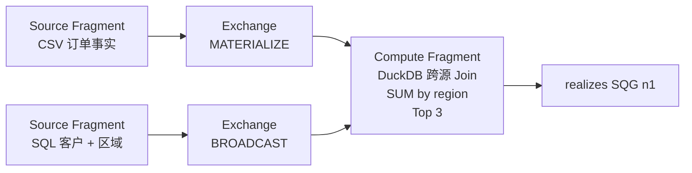
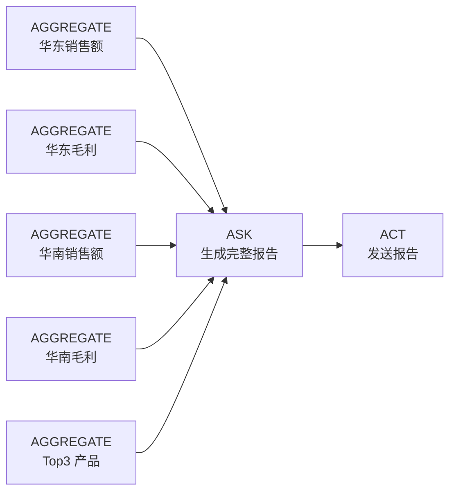

# Data Nexus SQG 与 PEP 算子详细说明书

> 文档版本：3.0  
> 对应实现：2026-07-22 当前代码  
> 适用范围：typed SQG v3、Bound Logical Plan v3、Fragment PEP v3  
> 事实来源：当前 Pydantic 模型、Binder、Optimizer、Coordinator 和 Resolver 实现，而非未来设计愿景

## 目录

1. [三层计划分别解决什么问题](#1-三层计划分别解决什么问题)
2. [SQG 图与节点公共契约](#2-sqg-图与节点公共契约)
3. [公共表达式与谓词语言](#3-公共表达式与谓词语言)
4. [SQG：SELECT](#4-sqgselect)
5. [SQG：AGGREGATE](#5-sqgaggregate)
6. [SQG：CALCULATE](#6-sqgcalculate)
7. [SQG：SEARCH](#7-sqgsearch)
8. [SQG：BROWSE](#8-sqgbrowse)
9. [SQG：ASK](#9-sqgask)
10. [SQG：ACT](#10-sqgact)
11. [Bound Logical Plan 中间算子](#11-bound-logical-plan-中间算子)
12. [PEP 图与节点公共契约](#12-pep-图与节点公共契约)
13. [PEP：SOURCE_FRAGMENT](#13-pepsource_fragment)
14. [PEP：EXCHANGE](#14-pepexchange)
15. [PEP：COMPUTE_FRAGMENT](#15-pepcompute_fragment)
16. [PEP：CAPABILITY](#16-pepcapability)
17. [Fragment 内部 QueryIR 算子](#17-fragment-内部-queryir-算子)
18. [SQG 到 PEP 的映射与优化规则](#18-sqg-到-pep-的映射与优化规则)
19. [完整执行示例](#19-完整执行示例)
20. [结果发布、失败传播与日志](#20-结果发布失败传播与日志)
21. [当前实现边界](#21-当前实现边界)
22. [算子选择速查表](#22-算子选择速查表)

---

## 1. 三层计划分别解决什么问题

Data Nexus 不把自然语言直接翻译成 SQL，而是依次形成三层表示：


| 层 | 面向对象 | 回答的问题 | 是否出现物理表/SQL |
|---|---|---|---|
| SQG | 用户、业务人员、Compiler | 为解决问题要完成哪些可理解的业务步骤？ | 否 |
| Bound Logical Plan | Binder、Optimizer、诊断 UI | 在不考虑执行位置时，逻辑上必须扫描、关联、过滤、聚合什么？ | 有绑定对象，但没有方言 SQL |
| PEP | Coordinator、Resolver、执行诊断 UI | 每块计算在哪里执行、何时执行、如何交换数据、实现哪个逻辑结果？ | 是 |

### 1.1 最重要的边界

1. SQG 是**面向人的业务任务 DAG**，不是关系代数树。
2. `FILTER`、`JOIN`、`ALIGN`、`SORT`、`LIMIT`、`PROJECT` 不是 SQG 节点。
3. 一个 SQG 节点可以由多个 PEP Fragment 协作实现。
4. 一个 PEP Fragment 也可以通过 `realizes` 同时实现多个 SQG 节点。
5. 是否共享扫描、融合聚合或下推运算由 Optimizer 决定，Compiler 不应为了省查询而破坏业务节点粒度。
6. 确定性数值计算必须进入 `AGGREGATE` 或 `CALCULATE`；`ASK` 只负责解释和组织内容。

### 1.2 三种依赖不要混淆

| 依赖 | 字段 | 含义 |
|---|---|---|
| 控制依赖 | SQG `depends_on` | 后一个任务必须等待前一个任务完成；不代表传递输出 |
| 数据依赖 | SQG `inputs` | 当前任务实际消费哪些上游 output，以及使用完整结果/行/列/标量中的哪一种 |
| 逻辑依赖 | Bound node `inputs` | 一个逻辑运算消费哪些逻辑运算 |
| 物理依赖 | PEP `depends_on` | 一个执行单元必须等待哪些物理节点完成 |

---

## 2. SQG 图与节点公共契约

源码模型：[`backend/app/nexus/core/logical.py`](../backend/app/nexus/core/logical.py)

### 2.1 SQG 顶层结构

```jsonc
{
  "version": 3,
  "question": "查询2024年每个月的销售金额中位数与平均数之比，找到最低的那个月",
  "nodes": [],
  "outputs": ["n3"],
  "context": {
    "intent": "月度统计与派生比较"
  }
}
```

| 字段 | 类型 | 默认值 | 含义 |
|---|---|---|---|
| `version` | integer | `3` | SQG Schema 版本 |
| `question` | string | 必填 | 原始用户问题 |
| `nodes` | SQG node array | `[]` | 业务任务节点 |
| `outputs` | string array | `[]` | 最终需要呈现的 SQG 节点 ID |
| `context` | object | `{}` | 编译器上下文、错误、尝试记录等 |

### 2.2 节点公共外壳

```jsonc
{
  "id": "n1",
  "operator": "AGGREGATE",
  "name": "统计2024年每月销售额中位数",
  "depends_on": [],
  "inputs": {},
  "spec": {}
}
```

| 字段 | 含义 |
|---|---|
| `id` | 一次 SQG 内稳定且唯一的节点 ID |
| `operator` | discriminated union 判别字段，决定 `spec` 的强类型 |
| `name` | 面向用户的业务任务名称 |
| `spec` | 算子专属契约 |
| `depends_on` | 控制依赖：当前节点必须等待完成的上游 SQG 节点 ID |
| `inputs` | 数据依赖：输入名到上游 `{node, output?, row?}` 的映射 |

`depends_on` 与 `inputs` 是正交契约：

- `depends_on` 只控制执行顺序，有依赖不代表一定消费输出；
- `inputs` 才表示消费上游 output；
- 每个 input node 必须也在 `depends_on` 中，反过来不要求，即 $inputNodes \subseteq dependsOn$；
- `output` 不填表示完整结果；填 output 表示一列；`row` 不填表示全部行；
- 输入保留原始类型，可以是表、行、列数组、标量、文档或文本。

### 2.3 图级校验

当前模型会校验：

- 节点 ID 不重复；
- 节点不能直接依赖自己；
- `depends_on` 引用的节点必须存在；
- `inputs.*.node` 引用的节点必须存在并同时位于 `depends_on`；
- `outputs` 引用的节点必须存在。
- 所有没有下游节点通过 `depends_on` 消费的终点节点都会自动加入 `outputs`；显式 outputs 可以额外保留非终点结果，但不能遗漏独立终点答案。
- 混合页面回答与动作交付时，被 ASK/ACT 消费的节点仍可同时列入 `outputs`。例如“查询 A、查询 B、把 C 发邮件”使用 `outputs=[A,B,ACT]`，邮件 ASK 只接收 C。

Generator 只把 `outputs` 指定的节点写入最终正文，但所有已执行节点仍保留在结构化数据和血缘中。若 `outputs` 为空，Generator 使用没有下游消费者的汇点节点作为输出。

### 2.4 Result Contract

`SELECT`、`AGGREGATE`、`CALCULATE` 使用显式 `ResultContract`：

```jsonc
{
  "kind": "RANKING",
  "name": "销售额前三的区域",
  "fields": [
    {
      "name": "region",
      "data_type": "text",
      "role": "dimension",
      "unit": null,
      "nullable": true
    },
    {
      "name": "sales_amount",
      "data_type": "number",
      "role": "measure",
      "unit": "CNY",
      "nullable": true
    }
  ],
  "grain": ["region"],
  "domain": null,
  "ordering": [],
  "unit": null
}
```

#### ResultKind

| 值 | 典型生产者 | 含义 |
|---|---|---|
| `SCALAR` | 无维度 AGGREGATE、CALCULATE | 单一业务值 |
| `TABLE` | SELECT、AGGREGATE、CALCULATE | 二维表 |
| `RANKING` | 带 `ranking` 的 AGGREGATE | 有排名语义的表 |
| `DOCUMENT` | BROWSE 的运行时结果种类 | 单篇网页/文档 |
| `SEARCH` | SEARCH 的运行时结果种类 | 搜索结果集合 |
| `TEXT` | ASK 的运行时结果种类 | 生成式文本 |
| `ACTION` | ACT 的运行时结果种类 | 动作回执 |

#### ResultField

| 字段 | 默认值 | 含义 |
|---|---|---|
| `name` | 必填 | 输出字段名，也是后续节点引用的稳定名称 |
| `data_type` | `unknown` | `number/text/date/datetime/bool/...` |
| `role` | `value` | `dimension`、`measure` 或 `value` |
| `unit` | `null` | `CNY`、`USD`、`%` 等业务单位 |
| `nullable` | `true` | 是否允许空值 |

#### ResultContract 其他字段

| 字段 | 默认值 | 含义 |
|---|---|---|
| `grain` | `[]` | 一行结果由哪些输出字段唯一确定 |
| `domain` | `null` | 结果覆盖域的描述 |
| `ordering` | `[]` | 结果契约中的业务顺序描述；物理排序仍由 `ranking/selection` 产生 |
| `unit` | `null` | 结果级默认单位 |

---

## 3. 公共表达式与谓词语言

源码模型：[`backend/app/nexus/core/expressions.py`](../backend/app/nexus/core/expressions.py)

表达式和谓词都是带 `kind` 判别字段的强类型 AST，不允许在逻辑计划中保存待解析的 SQL 字符串。

### 3.1 Expression 全集

| `kind` | 关键字段 | 用途 |
|---|---|---|
| `attribute` | `concept` | SQG/Bound IR 中引用本体属性 |
| `column` | `source`, `name` | QueryIR 中引用已绑定物理列 |
| `literal` | `value`, `data_type?` | 参数化常量 |
| `node_output` | `input`, `field` | CALCULATE 引用某个输入别名的字段 |
| `output` | `name` | 引用当前计算已产生的输出，或聚合后字段 |
| `binary` | `operator`, `left`, `right`, `zero_division` | 二元算术 |
| `unary` | `operator`, `operand` | 一元运算 |
| `function` | `name`, `arguments` | 标准函数 |
| `time_bucket` | `value`, `grain`, `calendar`, `timezone` | 时间分桶 |
| `aggregate` | 聚合函数及参数 | 规范化指标和 QueryIR 聚合表达式 |
| `case` | `branches`, `otherwise` | 条件派生表达式 |

### 3.2 二元、一元和函数运算符

#### Binary operator

| 运算符 | 语义 |
|---|---|
| `ADD` | 加法 |
| `SUBTRACT` | 减法 |
| `MULTIPLY` | 乘法 |
| `DIVIDE` | 普通除法 |
| `SAFE_DIVIDE` | 按 `zero_division` 处理除零 |

`zero_division` 可取：

- `NULL`：除数为零时返回空；默认值；
- `ZERO`：除数为零时返回 0；
- `ERROR`：除数为零时抛错。

#### Unary operator

当前只有 `NEGATE`，即数值取负。

#### Function name

模型允许：`COALESCE`、`ABS`、`ROUND`、`LOWER`、`UPPER`。

### 3.3 时间分桶

| 字段 | 可选值/默认值 |
|---|---|
| `grain` | `DAY`、`WEEK`、`MONTH`、`QUARTER`、`YEAR` |
| `calendar` | 默认 `GREGORIAN` |
| `timezone` | 默认 `UTC` |

Binder 把 SQG `TimeDimension` 转换为 `TimeBucketExpr`，Renderer 再按 SQL Server 或 DuckDB 方言生成日期表达式。

### 3.4 Aggregate function 全集

| 函数 | 说明 |
|---|---|
| `SUM` | 求和 |
| `COUNT` | 计数；`value=null` 时可表达 `COUNT(*)` |
| `COUNT_DISTINCT` | 去重计数 |
| `AVG` | 平均值 |
| `MIN` / `MAX` | 最小值/最大值 |
| `MEDIAN` | 中位数；内部等价于 0.5 分位数 |
| `PERCENTILE` | 分位数，必须提供 $0 \leq percentile \leq 1$ |
| `VARIANCE` | 样本方差 |
| `STDDEV` | 样本标准差 |

`AggregateExpr` 还支持：

- `distinct`：聚合前去重；
- `filter`：条件聚合；
- `method=CONTINUOUS|DISCRETE`：连续/离散分位数；
- `accuracy=EXACT|APPROXIMATE`：精度要求；
- `nulls=IGNORE|INCLUDE`：空值策略声明。

### 3.5 Predicate 全集

| `kind` | 关键字段 | 语义 |
|---|---|---|
| `true` | 无 | 恒真 |
| `comparison` | `left`, `operator`, `right` | 比较 |
| `in` | `value`, `values` | 集合包含 |
| `between` | `value`, `lower`, `upper`, 两个 inclusive 标志 | 区间判断 |
| `null` | `value`, `is_null` | 空/非空判断 |
| `time_range` | `attribute`, `start`, `end_exclusive`, `timezone` | 半开时间区间 |
| `and` | `operands` | 逻辑与 |
| `or` | `operands` | 逻辑或 |
| `not` | `operand` | 逻辑非 |

`comparison.operator` 支持：`EQ`、`NE`、`GT`、`GTE`、`LT`、`LTE`、`LIKE`。

时间范围推荐使用半开区间：

```jsonc
{
  "kind": "time_range",
  "attribute": "attribute.fact_order.order_date",
  "start": "2024-01-01",
  "end_exclusive": "2025-01-01",
  "timezone": "Asia/Shanghai"
}
```

Binder 会把它绑定成 `column >= start AND column < end_exclusive`。

### 3.6 表达式执行位置支持矩阵

| 表达式 | SQL/DuckDB QueryIR Renderer | CALCULATE 运行时 |
|---|---:|---:|
| `literal` | 支持 | 支持 |
| `attribute` | 必须先由 Binder 转成 column | 不直接支持 |
| `column` | 支持 | 不直接支持 |
| `node_output` | 不用于 QueryIR | 支持 |
| `output` | 支持 | 支持 |
| `binary` | 全部支持 | 全部支持 |
| `unary/NEGATE` | 支持 | 支持 |
| `COALESCE/ABS/ROUND` | 支持 | 支持 |
| `LOWER/UPPER` | 支持 | 当前 CALCULATE 不支持 |
| `time_bucket` | 支持 | 当前 CALCULATE 不支持 |
| `aggregate` | 支持 | 当前 CALCULATE 不支持 |
| `case` | 支持 | 当前 CALCULATE 不支持 |

---

## 4. SQG：SELECT

### 4.1 业务语义

`SELECT` 用于查询结构化明细、列举对象字段或取得唯一值集合。它不负责统计聚合。

典型问题：

- “列出客户名称和所属区域”；
- “查询 2024 年创建的订单明细”；
- “有哪些产品类别？”——使用 `distinct=true`。

### 4.2 Spec 字段

| 字段 | 类型 | 默认值 | 说明 |
|---|---|---|---|
| `subject` | `SubjectSpec` | 必填 | 主体实体 `{entity}` |
| `scope` | Predicate/null | `null` | 明细行过滤条件 |
| `fields` | `SelectField[]` | 必填 | `{concept, output}` 投影列表 |
| `distinct` | boolean | `false` | 是否对完整输出行去重 |
| `result` | ResultContract | 必填 | 结果契约 |

### 4.3 示例

```jsonc
{
  "id": "n1",
  "operator": "SELECT",
  "name": "客户及其所属区域",
  "depends_on": [],
  "spec": {
    "subject": {"entity": "entity.customer"},
    "scope": null,
    "fields": [
      {"concept": "attribute.customer.name", "output": "customer_name"},
      {"concept": "attribute.region.name", "output": "region"}
    ],
    "distinct": false,
    "result": {
      "kind": "TABLE",
      "name": "客户及区域",
      "fields": [
        {"name": "customer_name", "data_type": "text", "role": "dimension"},
        {"name": "region", "data_type": "text", "role": "dimension"}
      ],
      "grain": ["customer_name"]
    }
  }
}
```

### 4.4 Lowering 与物理执行

Binder 通常将一个 `SELECT` 降低为：

```text
SCAN × N → RELATE × M → FILTER? → PROJECT 或 DISTINCT
```

同一 Source Instance 内，Optimizer 把整段编译为一个 `SOURCE_FRAGMENT`：

- relation 变为 `QueryJoin`；
- `scope` 变为 `QueryIR.predicate`；
- `fields` 变为 `QueryIR.outputs`；
- `distinct` 变为 `SELECT DISTINCT`。

### 4.5 当前限制

- 当前 Optimizer 不支持跨 Source Instance 的 `SELECT`；跨源路径会报 `cross-source SELECT is not supported`。
- `SELECT` 没有排序和分页字段；需要此能力时应扩展强类型契约，而不是在 `scope` 中塞字符串。

---

## 5. SQG：AGGREGATE

### 5.1 业务语义

`AGGREGATE` 表达一项可独立命名的统计任务，包括分组、统计、结果过滤和排名。

一个节点只表达**一个主要业务结果**。例如“华东和华南的销售额和毛利”应拆为四个 SQG 节点；Optimizer 可以在 PEP 中把四个任务融合为一次查询。

### 5.2 Spec 字段

| 字段 | 类型 | 默认值 | 说明 |
|---|---|---|---|
| `subject` | SubjectSpec | 必填 | 统计主体实体 |
| `scope` | Predicate/null | `null` | 聚合前行过滤 |
| `dimensions` | DimensionSpec[] | `[]` | 分组维度 |
| `measure` | MeasureSpec | 必填 | 预定义指标或 ad-hoc statistic |
| `result_filter` | Predicate/null | `null` | 聚合结果过滤 |
| `ranking` | RankingSpec/null | `null` | 排序与截断 |
| `domain_policy` | DomainPolicy | 排除未匹配 | 关系未匹配行策略 |
| `result` | ResultContract | 必填 | 结果契约 |

### 5.3 DimensionSpec

#### 普通属性维度

```jsonc
{
  "kind": "attribute",
  "concept": "attribute.region.name",
  "output": "region"
}
```

#### 时间维度

```jsonc
{
  "kind": "time",
  "attribute": "attribute.fact_order.order_date",
  "grain": "MONTH",
  "calendar": "GREGORIAN",
  "timezone": "Asia/Shanghai",
  "output": "period"
}
```

### 5.4 MeasureSpec

#### 预定义 metric

```jsonc
{
  "kind": "metric",
  "metric": "metric.sales_amount",
  "output": "sales_amount"
}
```

Binder 从本体读取 metric 的 typed expression；metric 可以是聚合叶子组成的算术表达式，例如销售额与成本聚合后的差值。

#### Ad-hoc statistic

```jsonc
{
  "kind": "statistic",
  "value": {
    "kind": "attribute",
    "concept": "attribute.fact_order.amount"
  },
  "statistic": {
    "function": "MEDIAN",
    "percentile": null,
    "method": "CONTINUOUS",
    "accuracy": "EXACT",
    "nulls": "IGNORE",
    "distinct": false
  },
  "output": "median_amount"
}
```

`PERCENTILE` 必须提供 `percentile`；其他函数可不提供。

### 5.5 RankingSpec

| 字段 | 默认值 | 说明 |
|---|---|---|
| `by` | 必填 | 排序字段，通常是 measure output |
| `direction` | `DESC` | `ASC` 或 `DESC` |
| `take` | 必填且大于 0 | 截取数量 |
| `ties` | `EXCLUDE` | `EXCLUDE` 或 `INCLUDE` |
| `tie_breakers` | `[]` | 稳定次序键；当前 AGGREGATE 校验要求至少一个 |

```jsonc
{
  "by": "sales_amount",
  "direction": "DESC",
  "take": 3,
  "ties": "EXCLUDE",
  "tie_breakers": [
    {"field": "region", "direction": "ASC", "nulls": "LAST"}
  ]
}
```

### 5.6 DomainPolicy

| `unmatched` | Join 语义 | 要求 |
|---|---|---|
| `EXCLUDE_UNMATCHED` | `INNER JOIN` | 默认，无额外要求 |
| `KEEP_AS_UNKNOWN` | `LEFT JOIN` | 未匹配维度保留；`unknown_label` 默认“未知”，当前执行层尚未自动替换空标签 |
| `ERROR_ON_UNMATCHED` | 可信关系上使用 `INNER JOIN` | 关系必须 mandatory、`ENFORCED/DECLARED` 且 `confidence >= 1`，否则规划失败 |

### 5.7 完整示例

```jsonc
{
  "id": "n1",
  "operator": "AGGREGATE",
  "name": "销售额前三的区域",
  "depends_on": [],
  "spec": {
    "subject": {"entity": "entity.fact_order"},
    "scope": {
      "kind": "time_range",
      "attribute": "attribute.fact_order.order_date",
      "start": "2024-01-01",
      "end_exclusive": "2025-01-01",
      "timezone": "Asia/Shanghai"
    },
    "dimensions": [
      {"kind": "attribute", "concept": "attribute.region.name", "output": "region"}
    ],
    "measure": {
      "kind": "metric",
      "metric": "metric.sales_amount",
      "output": "sales_amount"
    },
    "result_filter": null,
    "ranking": {
      "by": "sales_amount",
      "direction": "DESC",
      "take": 3,
      "ties": "EXCLUDE",
      "tie_breakers": [
        {"field": "region", "direction": "ASC", "nulls": "LAST"}
      ]
    },
    "domain_policy": {
      "unmatched": "EXCLUDE_UNMATCHED",
      "unknown_label": "未知"
    },
    "result": {
      "kind": "RANKING",
      "name": "销售额前三的区域",
      "fields": [
        {"name": "region", "data_type": "text", "role": "dimension"},
        {"name": "sales_amount", "data_type": "number", "role": "measure", "unit": "CNY"}
      ],
      "grain": ["region"]
    }
  }
}
```

### 5.8 编译与绑定校验

- `ranking` 必须有确定性 `tie_breakers`；
- `SUM/AVG` 引用的属性必须为 number；
- `SUM` 禁止用于 `additivity=non_additive` 的属性；
- 所需实体必须能通过本体 relation 连通；
- Compiler 禁止把“多个明确成员 + 同一 group attribute”合并成一个 `IN (...) + GROUP BY` 节点；
- AGGREGATE 自动补齐遗漏的 dimension/measure result fields，并在 `result.grain` 为空时填入维度输出名。

### 5.9 物理策略

1. **单源完全下推**：生成一个 `SOURCE_FRAGMENT`。
2. **源不支持某聚合**：生成源投影、`EXCHANGE`、DuckDB `COMPUTE_FRAGMENT`。
3. **跨源聚合**：每个源生成 Source Fragment，同源关系先下推；之后 Exchange 到 DuckDB 完成跨源 Join、聚合和 TopN。
4. **同粒度多指标融合**：多个 SQG 节点可在一个 Source Fragment 中输出多列，通过 `realizes` 分发。
5. **结果过滤/TopN 分支**：共享聚合后，为不同任务生成独立 Compute Fragment 后处理。

---

## 6. SQG：CALCULATE

### 6.1 业务语义

`CALCULATE` 对上游逻辑结果执行确定性对齐、算术、派生和极值选择。它是 Data Nexus 引擎内建能力，不依赖本体挂载 Resolver。

适用场景：

- 中位数 ÷ 平均数；
- 本期 − 上期；
- 两个来源指标的差异率；
- 找出比值最低月份；
- 对多个已聚合结果按共同 grain 对齐。

不适用场景：

- 需要解释原因或写报告——使用 `ASK`；
- 可以直接在一个数据域内完成的原始行聚合——优先 `AGGREGATE`。

### 6.2 Spec 字段

| 字段 | 类型 | 说明 |
|---|---|---|
| `alignment` | AlignmentSpec | 输入行对齐方式 |
| `outputs` | NamedExpression[] | 按顺序计算的命名输出 |
| `selection` | SelectionSpec/null | 计算后极值或 TopN 选择 |
| `result` | ResultContract | 结果契约 |

CALCULATE 使用节点公共 `inputs` 接收上游完整结果；它们必须在 `depends_on` 中，但 `depends_on` 还可以包含只控制顺序、不参与计算的节点。

### 6.3 AlignmentSpec

| 字段 | 默认值 | 说明 |
|---|---|---|
| `keys` | `[]` | 各输入共有的、同名 grain 字段 |
| `domain` | `INNER` | `INNER`、`LEFT` 或 `OUTER` |
| `scalar_broadcast` | `false` | 声明允许标量广播 |

对齐域：

- `INNER`：只保留所有输入都存在的 key；
- `LEFT`：保留 `inputs` 中第一个别名的 key；
- `OUTER`：保留任一输入存在的 key。

### 6.4 NamedExpression

```jsonc
{
  "name": "ratio",
  "expression": {
    "kind": "binary",
    "operator": "SAFE_DIVIDE",
    "left": {"kind": "node_output", "input": "median", "field": "median_amount"},
    "right": {"kind": "node_output", "input": "average", "field": "avg_amount"},
    "zero_division": "NULL"
  }
}
```

`outputs` 按数组顺序执行，后一个输出可以通过 `{"kind":"output","name":"..."}` 引用前面已经算出的输出。

### 6.5 SelectionSpec

| 字段 | 默认值 | 说明 |
|---|---|---|
| `kind` | 必填 | `MIN_BY`、`MAX_BY`、`TOP_N`、`BOTTOM_N` |
| `field` | 必填 | 用于选择的 output 字段 |
| `take` | `1` | 保留行数，必须大于 0 |
| `nulls` | `LAST` | 空值顺序声明 |
| `tie_breakers` | `[]` | 稳定次序声明 |

### 6.6 完整示例

```jsonc
{
  "id": "n3",
  "operator": "CALCULATE",
  "name": "计算每月中位数与平均数之比并找出最低月份",
  "depends_on": ["n1", "n2"],
  "inputs": {
    "median": {"node": "n1"},
    "average": {"node": "n2"}
  },
  "spec": {
    "alignment": {
      "keys": ["period"],
      "domain": "INNER",
      "scalar_broadcast": false
    },
    "outputs": [
      {
        "name": "period",
        "expression": {"kind": "node_output", "input": "median", "field": "period"}
      },
      {
        "name": "ratio",
        "expression": {
          "kind": "binary",
          "operator": "SAFE_DIVIDE",
          "left": {"kind": "node_output", "input": "median", "field": "median_amount"},
          "right": {"kind": "node_output", "input": "average", "field": "avg_amount"},
          "zero_division": "NULL"
        }
      }
    ],
    "selection": {
      "kind": "MIN_BY",
      "field": "ratio",
      "take": 1,
      "nulls": "LAST",
      "tie_breakers": [
        {"field": "period", "direction": "ASC", "nulls": "LAST"}
      ]
    },
    "result": {
      "kind": "TABLE",
      "name": "比值最低月份",
      "fields": [
        {"name": "period", "data_type": "date", "role": "dimension"},
        {"name": "ratio", "data_type": "number", "role": "measure"}
      ],
      "grain": ["period"]
    }
  }
}
```

### 6.7 编译校验

- CALCULATE 至少有一个 input；每个 input node 必须在 `depends_on` 中，但无需与 `depends_on` 完全相等；
- CALCULATE 接收完整上游结果，不能在 input 中预选 `row/output`；
- 每个输入都必须有 Result Contract；
- 每个 `alignment.keys` 都必须存在于所有输入的 `result.grain`；
- 多行输入没有 alignment key 时必须明确 `scalar_broadcast=true`；
- `node_output.input` 必须是已声明输入别名；
- `node_output.field` 必须存在于对应输入的 `result.fields`；
- 每个命名 output 必须存在于 `result.fields`；
- `selection.field` 和 tie breaker 必须引用已声明 output。

### 6.8 Lowering 与物理执行

CALCULATE 在 Bound Logical Plan 中是 `CALCULATE`，在 PEP 中成为：

```text
CAPABILITY
  operator = CALCULATE
  resolver = (compute)
  call.mode = calculate
```

Coordinator 从逻辑结果注册表读取上游行，按 alignment 建索引，逐行执行 expression，最后执行 selection。

---

## 7. SQG：SEARCH

### 7.1 业务语义

`SEARCH` 搜索公开 Web 信息，返回一组带标题、URL 和正文片段的搜索结果。当前由 Web IQ Resolver 执行。

### 7.2 Spec 字段

| 字段 | 默认值 | 说明 |
|---|---|---|
| `query` | 必填 | 搜索词，运行时限制 1000 字符 |
| `max_results` | `10` | 模型范围 1–100；当前 Web IQ 调用会夹紧到 1–50 |
| `language` | `null` | 语言；Resolver 默认 `en` |
| `region` | `null` | 区域；Resolver 默认 `US` |
| `max_length` | `null` | 单次内容长度；Resolver 默认 10000 |
| `content_format` | `null` | Resolver 默认 `passage` |
| `location` | `null` | 地理位置提示 |
| `include_adult` | `null` | 是否保留成人内容；默认 false |

### 7.3 示例

```jsonc
{
  "id": "n1",
  "operator": "SEARCH",
  "name": "搜索目标公司的最新公开信息",
  "depends_on": [],
  "spec": {
    "query": "目标公司 2026 最新业务进展",
    "max_results": 10,
    "language": "zh",
    "region": "CN",
    "content_format": "passage"
  }
}
```

依赖上游结果的动态搜索必须通过节点公共 `inputs` 接收 output，不能把“销量最高的产品”留给 Resolver 猜测：

```jsonc
{
  "id": "n2",
  "operator": "SEARCH",
  "name": "搜索销量最高产品的最新新闻",
  "depends_on": ["n1"],
  "inputs": {
    "product_name": {"node": "n1", "output": "product", "row": 0}
  },
  "spec": {
    "query": "{product_name} 最新新闻",
    "max_results": 10
  }
}
```

编译期要求：

- input node 必须同时出现在 `depends_on`；
- 选择 `output` 时，上游必须有 Result Contract 且该字段存在；
- query 中的 `{input_name}` 必须对应已声明 input；
- 静态搜索可以有空 inputs；它仍可以有只控制顺序的 `depends_on`。

### 7.4 PEP 与结果

- PEP 节点：`CAPABILITY`；
- `operator=SEARCH`；
- Optimizer 选择第一个处于允许范围且声明支持 SEARCH 的 Resolver；
- `call.mode=search`；Coordinator 在调用 Resolver 前解析 inputs，并仅对 query 中明确的 `{input_name}` 做标量格式化；解析后的真实 query 写回最终 run-node call；
- 运行结果通常包含 `title/url/content/crawledAt/lastUpdatedAt/language`；
- 默认 `trust=0.75`；
- Generator 把结果渲染为“序号、标题、摘要、来源”表格，并为每条 URL 建立血缘。

---

## 8. SQG：BROWSE

### 8.1 业务语义

`BROWSE` 读取一个明确的 HTTP/HTTPS URL，适用于已知网页、搜索结果详情或指定文档。

### 8.2 Spec 字段

| 字段 | 默认值 | 说明 |
|---|---|---|
| `url` | 必填 | 必须是 HTTP/HTTPS URL |
| `max_length` | `null` | Resolver 默认 20000 |
| `live_crawl` | `null` | Resolver 默认 `fallback` |
| `render_dynamic_pages` | `null` | Resolver 默认 true |
| `include_web_links` | `null` | Resolver 默认 false |
| `include_image_links` | `null` | Resolver 默认 false |
| `language` | `null` | Resolver 默认 `en` |
| `region` | `null` | Resolver 默认 `US` |
| `content_format` | `null` | Resolver 默认 `markdown` |

### 8.3 示例

```jsonc
{
  "id": "n2",
  "operator": "BROWSE",
  "name": "读取公告正文",
  "depends_on": [],
  "spec": {
    "url": "https://example.com/announcement",
    "max_length": 30000,
    "render_dynamic_pages": true,
    "content_format": "markdown"
  }
}
```

### 8.4 PEP 与结果

- PEP 节点：`CAPABILITY`；
- `operator=BROWSE`，`call.mode=browse`；
- Web IQ 对 HTTP 202、429、430、500、503、504 实施等待/重试；
- 返回单行文档，包括标题、URL、正文、抓取时间及可选链接；
- 默认 `trust=0.75`；
- Generator 最多把正文前 2000 个字符写入最终答案，完整内容仍保留在 lineage detail。

---

## 9. SQG：ASK

### 9.1 业务语义

`ASK` 使用 LLM 对已有结果进行解释、归纳、组织或生成报告。它不得替代确定性数值运算。

### 9.2 Spec 字段

| 字段 | 默认值 | 说明 |
|---|---|---|
| `instruction` | 必填 | 内容生成要求 |
| `format` | `MARKDOWN` | `MARKDOWN` 或 `TEXT` |
| `system` | `null` | 可选系统提示词 |

### 9.3 示例

```jsonc
{
  "id": "n6",
  "operator": "ASK",
  "name": "生成销售分析报告",
  "depends_on": ["n1", "n2", "n3", "n4", "n5"],
  "inputs": {
    "east_sales": {"node": "n1"},
    "east_profit": {"node": "n2"},
    "south_sales": {"node": "n3"},
    "south_profit": {"node": "n4"},
    "top_products": {"node": "n5"}
  },
  "spec": {
    "instruction": "根据输入数据生成简洁的中文销售报告，不得修改或重新计算数值。",
    "format": "MARKDOWN"
  }
}
```

### 9.4 编译约束

- 只要图中存在结构化数据任务，ASK 就必须通过 inputs 消费至少一个结构化结果；
- 报告邮件场景中，报告 ASK 必须覆盖所有待报告数据节点；
- 不能创建无上游、只复述用户要求的“明确报告口径”ASK；
- 排名、比例、差值和极值必须由 AGGREGATE/CALCULATE 先计算好。

### 9.5 PEP 与运行

- PEP 节点：`CAPABILITY`；
- Resolver：第一个允许且声明支持 ASK 的 Agent Resolver；
- Coordinator 保持 inputs 的表/行/列/标量原始结构，组装成 JSON，并附加：输入数据只可解释和组织、不得修改或重新计算；
- Agent Resolver 把文本返回为 `rows=[{"value": text}]`，默认 `trust=0.8`；
- prompt 的 system/user 内容写入节点 logs，便于复盘。

---

## 10. SQG：ACT

### 10.1 业务语义

`ACT` 执行业务动作，例如发邮件、创建工单、触发审批或写回系统。SQG 中保留一个高层动作节点，不把收件人解析、API 鉴权等技术步骤拆成节点。

### 10.2 Spec 字段

| 字段 | 默认值 | 说明 |
|---|---|---|
| `action` | 必填 | 动作名称，例如 `EMAIL.SEND` |
| `recipient` | `null` | 业务接收对象 |
| `assignee` | `null` | 负责人 |
| `title` | `null` | 标题 |
| `parameters` | `{}` | 动作专属参数 |

### 10.3 示例

```jsonc
{
  "id": "n7",
  "operator": "ACT",
  "name": "把报告发送给颜斌",
  "depends_on": ["n6"],
  "inputs": {
    "report": {"node": "n6", "output": "value", "row": 0}
  },
  "spec": {
    "action": "EMAIL.SEND",
    "recipient": "颜斌",
    "title": "2024年销售分析",
    "parameters": {}
  }
}
```

### 10.4 编译约束

对 `EMAIL.SEND`：

- 必须有一个上游 ASK 生成完整报告正文；
- 必须通过 inputs 接收报告 ASK 的 output；`depends_on` 本身不传数据；
- 报告 input 必须选择文本标量 `output="value", row=0`；若 `parameters.body` 使用 `{report}`，该 input 不能是完整表、行对象或列数组；
- 该 ASK 只接收用户明确要求通过邮件交付的数据；页面查询结果不应被强行并入邮件；
- EMAIL.SEND 不应绕过 ASK 直接拼接多个数据节点。

### 10.5 PEP 与运行

- PEP 节点：`CAPABILITY`；
- Coordinator 只把 `inputs` 指定的上游 output 序列化为 `desc`；纯 `depends_on` 不传数据；
- 如果有 `recipient` 而没有 `assignee`，Coordinator 自动令 `assignee=recipient`；
- 当前默认 Action Resolver 是演示实现：创建 `TASK-XXXXXX` 回执，不是真实邮件发送器；
- 默认动作结果 `trust=1.0`。

---

## 11. Bound Logical Plan 中间算子

源码模型：[`backend/app/nexus/core/intermediate.py`](../backend/app/nexus/core/intermediate.py)  
Binder：[`backend/app/nexus/engine/binder.py`](../backend/app/nexus/engine/binder.py)

Bound Logical Plan 不是用户可见 SQG，也不是可执行 PEP。它是 Optimizer 用来推理关系路径、grain、domain 和运算顺序的方言中立 IR。

### 11.1 Semantic Binding

每个 SQG 任务形成一个 `SemanticTaskBinding`：

- `logical_node`：SQG node ID；
- `entities`：已绑定实体、物理对象、Source Instance 和 key；
- `attributes`：已绑定列、数据类型、角色和可加性；
- `metrics`：规范化 metric ID；
- `relations`：有方向的关系、复合键、双向 multiplicity、integrity 和 confidence；
- `source_instances`：涉及的数据源实例；
- `diagnostics`：绑定诊断。

### 11.2 BoundOperator 全集

| 算子 | 当前是否由 Binder 产生 | 含义 |
|---|---:|---|
| `SCAN` | 是 | 扫描一个已绑定实体 |
| `FILTER` | 是 | scope 过滤或聚合结果过滤 |
| `RELATE` | 是 | 沿本体 relation 关联实体 |
| `PROJECT` | 是 | SELECT 字段投影 |
| `DERIVE` | 否，预留 | 逻辑派生列 |
| `AGGREGATE` | 是 | 维度 + 规范化聚合表达式 |
| `DISTINCT` | 是 | SELECT 去重投影 |
| `WINDOW` | 否，预留 | 窗口计算 |
| `TOP_N` | 是 | AGGREGATE 排名和截断 |
| `CALCULATE` | 是 | 高层 CALCULATE 的逻辑表示 |
| `CAPABILITY` | 是 | SEARCH/BROWSE/ASK/ACT 能力调用 |

### 11.3 各 SQG 算子的典型 Lowering

| SQG | Bound Logical Plan |
|---|---|
| SELECT | `SCAN → RELATE? → FILTER? → PROJECT/DISTINCT` |
| AGGREGATE | `SCAN → RELATE? → FILTER? → AGGREGATE → FILTER? → TOP_N?` |
| CALCULATE | 一个 `CALCULATE`，inputs 指向上游逻辑输出 |
| SEARCH/BROWSE/ASK/ACT | 一个 `CAPABILITY`，inputs 指向上游逻辑输出 |

### 11.4 BoundLogicalNode 关键字段

| 字段 | 用途 |
|---|---|
| `id`, `kind`, `name` | 节点身份 |
| `inputs` | 上游 Bound node ID |
| `origin_sqg_nodes` | 来源 SQG 节点，用于跨层追踪 |
| `result_fields`, `grain`, `domain`, `cardinality` | 结果语义 |
| `source_candidates` | 候选执行源 |
| `entity`, `predicate`, `relation` | SCAN/FILTER/RELATE 专属内容 |
| `expressions`, `dimensions`, `aggregate` | 投影、维度和聚合表达式 |
| `order_by`, `limit` | TOP_N |
| `capability` | 能力名称 |

---

## 12. PEP 图与节点公共契约

源码模型：[`backend/app/nexus/core/physical.py`](../backend/app/nexus/core/physical.py)

PEP 是按执行位置切分后的 Fragment DAG。当前只有四种物理节点 `kind`：

| kind | 作用 |
|---|---|
| `SOURCE_FRAGMENT` | 在一个 Source Instance 内执行 QueryIR |
| `EXCHANGE` | 把上游结果移入另一个执行位置 |
| `COMPUTE_FRAGMENT` | 在 DuckDB 计算引擎执行 QueryIR |
| `CAPABILITY` | 调用非关系能力或引擎内建 CALCULATE |

### 12.1 PhysicalExecutionPlan

```jsonc
{
  "artifact_type": "physical_execution_plan",
  "version": 3,
  "nodes": [],
  "logical_results": {},
  "context": {
    "parallelism": 4,
    "logical_to_physical": {},
    "max_wave": 1
  }
}
```

| 字段 | 默认值 | 含义 |
|---|---|---|
| `artifact_type` | `physical_execution_plan` | artifact 类型 |
| `version` | `3` | PEP Schema 版本 |
| `nodes` | `[]` | 物理 Fragment 节点 |
| `logical_results` | `{}` | 有显式 result spec 的 SQG 节点契约 |
| `context` | `{}` | 并行度、逻辑到物理映射、最大波次 |

### 12.2 公共执行字段

四种节点共享以下概念：

| 字段 | 含义 |
|---|---|
| `id` | 物理节点 ID |
| `kind` | PEP discriminated union 判别字段 |
| `name` | 执行单元名称 |
| `depends_on` | 必须先完成的物理节点 ID |
| `wave` | 拓扑执行波次，默认 1，Optimizer 最终重算 |
| `realizes` | 物理结果到 SQG 逻辑结果的映射 |
| `estimates` | 可选 `rows/bytes/cost` 估算 |

`CapabilityFragment` 当前没有 `estimates` 字段；其他三种 Fragment 有。

### 12.3 Wave 与并行

Optimizer 根据 `depends_on` 做拓扑分波：

- 同一 wave 内最多按 `parallelism` 并行执行；默认值为 4；
- wave 之间顺序执行；
- 任一上游结果失败，下游节点标记 `skipped: upstream failed`；
- 当前 Coordinator 使用线程池执行同波节点；
- Compute Fragment 共享一次 run 内的 DuckDB 连接，并通过锁串行访问。

### 12.4 realizes：物理结果如何发布为 SQG 结果

```jsonc
{
  "logical_node": "east_sales",
  "logical_field": "sales_amount",
  "physical_field": "east_sales",
  "physical_result": null
}
```

| 字段 | 用途 |
|---|---|
| `logical_node` | 要写入逻辑结果注册表的 SQG node ID |
| `logical_field` | 发布后的业务字段名 |
| `physical_field` | 从物理结果中抽取的列名 |
| `physical_result` | 物理结果集合名称的元数据，例如 `result_set`/`result` |

两种主要模式：

1. **整表发布**：只给 `logical_node` 和 `physical_result`，把整个结果集注册给一个 SQG 节点。
2. **融合列拆分**：使用 `physical_field → logical_field`；Coordinator 同时保留 QueryIR dimension 列，不需要额外 PROJECT 节点。

---

## 13. PEP：SOURCE_FRAGMENT

### 13.1 物理语义

`SOURCE_FRAGMENT` 是一个 Source Instance 能一次编译和执行的 QueryIR。它是 SQL、CSV/DuckDB 等关系型 Resolver 的物理执行边界。

### 13.2 字段

| 字段 | 类型/默认值 | 说明 |
|---|---|---|
| `id` | string | 物理节点 ID |
| `kind` | 固定 `SOURCE_FRAGMENT` | 节点类型 |
| `name` | string | 名称 |
| `source_instance` | string | Resolver 实例名 |
| `query` | QueryIR | 方言中立查询 |
| `call` | object，默认 `{}` | Resolver 已编译调用，如 SQL + params |
| `depends_on` | `[]` | 物理依赖 |
| `wave` | `1` | 执行波次 |
| `realizes` | `[]` | 逻辑结果映射 |
| `estimates` | `null` | 行数、字节和成本估算 |

### 13.3 执行过程

1. Optimizer 生成 typed QueryIR。
2. Resolver 的 `compile(query)` 按方言生成 `call`。
3. SQL Resolver 生成参数化 SQL Server SQL；CSV Resolver 生成 DuckDB SQL。
4. Coordinator 调用该 `source_instance` 的 `fetch(call)`。
5. Resolver 返回统一 `NodeResult`。
6. 如果节点有 `realizes`，Coordinator 发布逻辑 SQG 结果。

### 13.4 典型用途

- 单源 SELECT；
- 单源 AGGREGATE；
- 同源多表 JOIN；
- 同源多 SQG 指标融合；
- 跨源任务中每个源的列裁剪、局部过滤、局部 JOIN 和安全预聚合。

---

## 14. PEP：EXCHANGE

### 14.1 物理语义

`EXCHANGE` 表示执行位置之间的数据传输/物化边界。它不是业务计算，不执行过滤、Join 或聚合。

### 14.2 字段

| 字段 | 类型/默认值 | 说明 |
|---|---|---|
| `kind` | 固定 `EXCHANGE` | 节点类型 |
| `mode` | 默认 `MATERIALIZE` | 交换模式 |
| `from_fragment` | string | 数据生产者 PEP ID |
| `into` | string | 目标临时表名 |
| `depends_on` | string[] | 通常等于 `[from_fragment]` |
| `wave` | 默认 1 | 执行波次 |
| `realizes` | 默认 `[]` | 通常不直接发布逻辑结果 |
| `estimates` | `null` | 传输估算 |

### 14.3 模型声明的 Exchange mode

| mode | 设计含义 | 当前 Optimizer 是否生成 | 当前 Coordinator 行为 |
|---|---|---:|---|
| `MATERIALIZE` | 完整物化主输入 | 是，跨源第一个输入 | 复制上游 rows/columns/output |
| `BROADCAST` | 广播较小输入 | 是，跨源第二个及之后输入 | 与 MATERIALIZE 相同 |
| `SEMI_JOIN_KEYS` | 只交换 Join key 以反向过滤 | 否 | 未实现专属行为 |
| `STREAM` | 流式传输 | 否 | 未实现专属行为 |

### 14.4 当前执行机制

当前 Coordinator 中 Exchange 是显式 pass-through：

1. 从 `ctx.physical_results[from_fragment]` 取上游结果；
2. 复制 rows、columns 和 output；
3. 将 `mode` 写入 detail；
4. 后续 Compute Fragment 再把这些 rows 加载到 DuckDB 临时表。

因此，当前 `BROADCAST` 与 `MATERIALIZE` 的实际数据动作相同；两者主要表达计划意图、调度边界和血缘。未来分布式执行器可在不改变 PEP Schema 的情况下实现真正广播、流式和半连接键交换。

---

## 15. PEP：COMPUTE_FRAGMENT

### 15.1 物理语义

`COMPUTE_FRAGMENT` 在中立计算引擎中执行不能或不应在源端完成的关系计算。当前引擎固定为一次 run 独享的内存 DuckDB。

### 15.2 字段

| 字段 | 类型/默认值 | 说明 |
|---|---|---|
| `kind` | 固定 `COMPUTE_FRAGMENT` | 节点类型 |
| `engine` | 默认 `duckdb` | 计算引擎标识 |
| `inputs` | ComputeInput[] | 临时表名到上游 Fragment 的映射 |
| `query` | QueryIR | 要执行的方言中立查询 |
| `into` | `null` | 若有值，同时把结果物化为该临时表 |
| `depends_on` | string[] | 输入 Fragment 依赖 |
| `wave` | 默认 1 | 执行波次 |
| `realizes` | 默认 `[]` | 逻辑结果映射 |
| `estimates` | `null` | 成本估算 |

`ComputeInput`：

```jsonc
{
  "table": "x_n1_0",
  "from_fragment": "p_n1_exchange_0"
}
```

### 15.3 执行过程

1. Coordinator 创建一次 run 独享的 DuckDB `:memory:` 实例。
2. 对每个 input，将上游 `NodeResult.rows` 加载为临时表。
3. 根据首批非空 Python 值推断 DuckDB 类型：boolean、bigint、double、timestamp、date 或 varchar。
4. 使用通用 QueryRenderer 生成参数化 DuckDB SQL。
5. 执行查询；若 `into` 有值，则先 `CREATE TABLE AS` 再读回。
6. 返回 rows，并通过 `realizes` 发布逻辑结果。

### 15.4 典型用途

- 跨 Source Instance Join；
- 源不支持的 MEDIAN/PERCENTILE 等聚合；
- 融合聚合后的独立 result filter/TopN 分支；
- 可信多对一预聚合后的最终再聚合；
- 后续可扩展的中立关系计算。

### 15.5 与 CALCULATE 的区别

| 对比 | COMPUTE_FRAGMENT | CALCULATE Capability |
|---|---|---|
| 输入 | 物理 Fragment rows | 已发布的 SQG 逻辑结果 |
| 计算语言 | QueryIR + SQL Renderer | Python 中的 CALCULATE expression evaluator |
| 擅长 | Join、过滤、分组、聚合、TopN | 按 grain 对齐多个业务结果、派生算术、极值选择 |
| 输出映射 | `realizes` | `realizes` |

---

## 16. PEP：CAPABILITY

### 16.1 物理语义

`CAPABILITY` 统一表示非关系能力调用，以及引擎内建的 CALCULATE。

### 16.2 字段

| 字段 | 类型/默认值 | 说明 |
|---|---|---|
| `kind` | 固定 `CAPABILITY` | 节点类型 |
| `operator` | SQG Operator | CALCULATE/SEARCH/BROWSE/ASK/ACT |
| `resolver` | string | Resolver 名称，或 CALCULATE 的 `(compute)` |
| `call` | object | 能力专属调用体 |
| `depends_on` | 默认 `[]` | 上游物理节点 |
| `wave` | 默认 1 | 波次 |
| `realizes` | 默认 `[]` | 逻辑结果映射 |

### 16.3 SQG 到 Capability call

| SQG | Resolver | 关键 call 字段 |
|---|---|---|
| CALCULATE | `(compute)` | `mode=calculate`、完整 typed spec、`input_refs` |
| SEARCH | Web IQ | `mode=search`、SearchSpec、`input_refs` |
| BROWSE | Web IQ | `mode=browse`、BrowseSpec、`input_refs` |
| ASK | Agent | `prompt/instruction/system/format`、`input_refs` |
| ACT | Action | `action/recipient/assignee/title/parameters`、`input_refs` |

### 16.4 Resolver 选择

- CALCULATE 始终使用引擎内建 `(compute)`；
- 其他能力遍历 Registry，选择第一个同时满足“处于本体允许集合”且 `resolver.operators` 声明支持该 operator 的 Resolver；
- 找不到时规划失败：`no resolver supports ...`。

---

## 17. Fragment 内部 QueryIR 算子

PEP 图把一段可一次执行的关系运算封装为 Fragment。Fragment 内部不是 SQL 字符串，而是 `QueryIR`。

### 17.1 QuerySource

| 字段 | 含义 |
|---|---|
| `entity` | 来源实体或上游 Fragment 标识 |
| `object_name` | 表、CSV locator 或 DuckDB 临时表 |
| `alias` | QueryIR 内部别名 |
| `source_instance` | 数据源/compute 实例 |

### 17.2 QueryJoin

| 字段 | 默认值 | 含义 |
|---|---|---|
| `relation` | 必填 | 本体 relation ID |
| `source` | 必填 | 被连接的 QuerySource |
| `left/right` | 必填 | 对齐的 typed Expression 列表，支持复合键 |
| `join_type` | `INNER` | `INNER` 或 `LEFT` |
| `cardinality` | `unknown` | 已知关系基数元数据 |

Renderer 按 `zip(left, right)` 生成多个等值条件，并以 AND 连接。

### 17.3 QueryOutput

```jsonc
{
  "name": "sales_amount",
  "expression": null,
  "aggregate": {
    "kind": "aggregate",
    "function": "SUM",
    "value": {"kind": "column", "source": "t0", "name": "amount"}
  }
}
```

一个输出使用 `expression` 或 `aggregate`。`name` 是物理结果列名。

### 17.4 QueryIR 字段与关系算子含义

| 字段 | 对应关系运算 | 执行顺序 |
|---|---|---:|
| `source` | SCAN/FROM | 1 |
| `joins` | JOIN | 2 |
| `predicate` | 聚合前 FILTER/WHERE | 3 |
| `dimensions` | 分组键/投影 | 4 |
| `outputs` | PROJECT、DERIVE、AGGREGATE | 5 |
| `result_predicate` | 聚合后 FILTER；当前渲染为外层子查询 WHERE | 6 |
| `distinct` | DISTINCT | 7（SELECT 修饰） |
| `order_by` | SORT | 8 |
| `limit` | LIMIT/TOP | 9 |

### 17.5 方言差异

| 能力 | DuckDB/通用 Renderer | SQL Server Renderer |
|---|---|---|
| 标识符 | `"name"` | `[name]` |
| limit | `LIMIT n` | `TOP (n)` |
| 时间桶 | `date_trunc` | `CAST/DATEADD/DATEFROMPARTS` |
| median/percentile | `quantile_cont/disc` | `PERCENTILE_CONT/DISC` 语法 |
| null ordering | `NULLS FIRST/LAST` | 当前移除显式 NULLS 子句 |
| 参数 | `?` | `?` |

Optimizer 依据 Resolver `capabilities().relational.aggregates` 决定是否允许聚合源端下推；例如当前 SQL Resolver 未声明 MEDIAN/PERCENTILE，因此会提升到 Compute Fragment，即使 Renderer 存在对应语法方法。

---

## 18. SQG 到 PEP 的映射与优化规则

### 18.1 基础映射

| SQG | 单源典型 PEP | 跨源/能力不足典型 PEP |
|---|---|---|
| SELECT | Source Fragment | 当前不支持跨源 SELECT |
| AGGREGATE | Source Fragment | Source × N → Exchange × N → Compute |
| CALCULATE | Capability `(compute)` | 同左 |
| SEARCH | Capability Web IQ | 同左 |
| BROWSE | Capability Web IQ | 同左 |
| ASK | Capability Agent | 同左 |
| ACT | Capability Action | 同左 |

### 18.2 单源完全下推

当任务只涉及一个 Source Instance，且该 Resolver 声明支持所有必需聚合函数：

- SELECT 的 Join、scope、projection、distinct 下推；
- AGGREGATE 的 Join、scope、time bucket、aggregate、result filter、order 和 limit 下推；
- 生成一个 Source Fragment；
- trace 记录 `single_source_pushdown=applied`。

### 18.3 多指标融合

Optimizer 的 fusion key 包含：

- Source Instance 集合；
- entity 路径；
- relation 路径；
- dimensions 的完整 typed JSON；
- domain unmatched policy。

同组多个 AGGREGATE：

1. 提取各 `scope` 的公共 AND 合取项作为 Source predicate；
2. 各任务剩余条件进入自身聚合叶子的 filter，渲染为条件聚合；
3. 一个物理 QueryIR 输出以 SQG node ID 命名的多列；
4. `realizes` 将每一列映射回各自 measure output；
5. SQG 仍保留原来的多个人类可读业务节点。

trace 记录：

- `common_predicate_extraction`；
- `multi_measure_fusion`。

### 18.4 聚合共享后的后处理分支

若融合任务带独立 `result_filter` 或 `ranking`：

- 公共 Source Fragment 先输出共享 grain 和各任务物理列；
- 每个需要后处理的任务生成独立 Compute Fragment；
- 分支执行自己的结果过滤、排序和 limit；
- 最后分支 Fragment 发布对应逻辑结果。

### 18.5 源能力不足时提升到 Compute

Optimizer 读取 Resolver 的 aggregate capability。若缺少所需函数：

1. Source Fragment 只取必需列并执行可下推内容；
2. Exchange 物化到 compute；
3. Compute Fragment 在 DuckDB 完成聚合；
4. trace 记录 `source_aggregate_pushdown=rejected` 和缺失函数。

### 18.6 跨源 Fragmentation

对于跨源 AGGREGATE：

1. 按 Source Instance 将实体分组；
2. 每个源内先执行本地 Join；
3. 只把完全属于该源的 scope 合取项下推；
4. 补入跨源 relation 所需键；
5. 每个源生成 Source Fragment；
6. 每个 Source 后生成 Exchange；
7. DuckDB Compute 按本体 relation 完成跨源 Join；
8. Compute 完成全局聚合、result filter 和 TopN；
9. trace 记录 `cross_source_fragmentation=applied`。

### 18.7 可信多对一边界预聚合

跨源事实侧预聚合只在全部条件成立时应用：

- 算子是 AGGREGATE；
- 规范化聚合叶子是 `SUM/COUNT/MIN/MAX`；
- measure 只来自 subject 所在源；
- 跨源边界从事实侧到维度侧的 `max=1`；
- integrity 为 `ENFORCED` 或 `DECLARED`；
- `confidence >= 1`；
- 有明确边界键。

应用时：

- 事实源先按边界键聚合为 `__partial_value`；
- COUNT 的最终聚合改为 SUM；
- SUM/MIN/MAX 使用同名最终聚合；
- Exchange 传输预聚合结果而不是全部事实行。

任一证明条件不满足时安全拒绝，并在 trace 中记录 relation、max、integrity 和 confidence。

### 18.8 Join 类型选择

Join 类型不是从字段是否可空猜测，而是由 `domain_policy`、relation optionality、integrity 和 confidence 共同决定。无法证明时选择保守计划或报错，不得因列同名而自行关联。

### 18.9 当前成本模型

PEP 模型已经有 `rows/bytes/cost` 和 PlanCandidate 字段，但当前 Optimizer 没有填充实际估算：

- Fragment `estimates` 通常为 `null`；
- 最终只追加一个 selected candidate；
- 选择理由为 `lowest safe plan among generated candidates`；
- Exchange 的 MATERIALIZE/BROADCAST 当前按输入位置决定，不是按 bytes 成本决定。

---

## 19. 完整执行示例

### 19.1 示例一：两个同粒度聚合 + CALCULATE

问题：查询 2024 年每个月销售金额中位数与平均数之比，找到最低月份。

#### SQG

```text
n1 AGGREGATE：每月中位数 ─┐
                           ├─> n3 CALCULATE：计算比值并 MIN_BY
n2 AGGREGATE：每月平均数 ─┘
```

若 CSV Resolver 同时支持 MEDIAN 和 AVG，Optimizer 可把 `n1/n2` 融合为一次 Source Fragment：

```text
Wave 1: p_fused_n1_n2 SOURCE_FRAGMENT
          outputs: period, n1, n2
          realizes:
            n1 ← physical n1 as median_amount
            n2 ← physical n2 as avg_amount

Wave 2: p_n3 CAPABILITY(CALCULATE)
          reads logical n1/n2
          aligns by period
          computes SAFE_DIVIDE
          selects MIN_BY ratio
          realizes n3
```

### 19.2 示例二：跨源“销售额前三区域”

事实订单在 CSV，客户和区域维度在 SQL Server：



分工：

- CSV Source：只取 amount 和 customer_id，可在关系可信时按 customer_id 预聚合；
- SQL Source：在源内先连接 customer 与 region；
- Exchange：把两边结果移入 compute 上下文；
- Compute：按 customer_id 跨源连接，按 region 汇总，执行全局 Top3；
- `realizes`：把最终结果发布给一个人类可见的 AGGREGATE 节点。

### 19.3 示例三：数据 → 报告 → 动作



可能的 PEP：

- `D1–D4` 因相同路径和 grain 融合成一个 Source Fragment；
- `D5` 独立 Source/Compute 分支；
- ASK 在所有数据物理节点完成后执行，并读取逻辑结果，而非物理列名；
- ACT 等待 ASK，消费报告正文。

---

## 20. 结果发布、失败传播与日志

### 20.1 两个结果注册表

Coordinator 维护：

| 注册表 | key | 用途 |
|---|---|---|
| `physical_results` | PEP node ID | 物理依赖、Exchange、Compute input |
| `results` | SQG node ID | CALCULATE、ASK、ACT、Generator 和 lineage |

`realizes` 是两者之间唯一正式桥梁。

### 20.2 NodeResult

每个物理或逻辑结果统一包含：

- `node_id`；
- `resolver`；
- `output`；
- `columns`；
- `rows`；
- `trust`；
- `error`；
- `source`；
- `detail`；
- `logs`。

### 20.3 失败传播

1. 节点执行异常被转换为带 traceback/error 的 NodeResult。
2. 当前节点状态记为 `failed`。
3. 依赖失败节点的下游记为 `skipped`。
4. 成功和失败结果都会通过 `realizes` 发布到逻辑节点；Generator 因此能显示明确失败，而不是误报“没有可用结果”。
5. 每个节点记录 call、完整 result、preview、source、trust、error、cost 和 logs。

### 20.4 Optimizer artifacts

Optimizer stage logs 保存：

| artifact | 内容 |
|---|---|
| `semantic_binding` | concept 到 entity/attribute/metric/relation/source 的绑定 |
| `bound_logical_plan` | SCAN/FILTER/RELATE/AGGREGATE/TOP_N 等逻辑 IR |
| `physical_execution_plan` | Fragment PEP、wave、realizes 和 compiled call |
| `optimization_trace` | 应用/拒绝的规则、候选和选择原因 |

### 20.5 LLM 调用与 Token

每次 LLM 调用在现有 JSON 日志列中保存完整调用记录：

- Initializer、Compiler：`run_stage.logs.llm_calls[]`；
- ASK：`run_node.logs.llm_calls[]`，并汇总到 Coordinator 的 `run_stage.logs.llm_calls[]`；
- 每条记录包含输入 messages、原始/解析输出、模型、deployment、request/response id、finish reason、耗时和 usage；
- usage 包含输入、Cached、未缓存输入、cache write、输出、reasoning 和总 Token，以及 Provider 返回的原始明细；
- `cached_input_tokens` 是 Azure/OpenAI Prompt Cache 的 `prompt_tokens_details.cached_tokens`，不是系统的路由/SQG/PEP 缓存；
- Provider 不返回的字段保持空值，不自行估算；
- API key、endpoint 和 Authorization 不进入日志。

前端在查询完成后汇总显示输入/输出/Cached Token；每个 Stage 详情显示逐次调用明细，ASK 的 PEP 节点详情也显示对应调用。

---

## 21. 当前实现边界

以下内容必须理解为**当前实现事实**，不能仅凭模型字段推断已经具备完整行为。

### 21.1 SQG/图校验

- 模型会禁止直接自依赖，但当前没有显式拒绝多节点间接环；`topo_waves` 遇到无法推进时会把剩余节点放入最后一波。生产级实现应增加严格环检测。

### 21.2 SELECT

- 跨源 SELECT 当前不支持；只有跨源 AGGREGATE 有完整 Fragmentation 路径。

### 21.3 AGGREGATE ranking

- `ties=INCLUDE` 已进入模型，但当前 Renderer 仍使用普通 TOP/LIMIT，没有实现“包含并列值”的专属语义。
- SQL Server Renderer 会移除 `NULLS FIRST/LAST`，因此 SQL Server 的实际空值顺序仍依赖数据库默认行为。
- `unknown_label` 已建模，但 `KEEP_AS_UNKNOWN` 当前只选择 LEFT JOIN，没有自动 `COALESCE` 成该标签。

### 21.4 CALCULATE

- `scalar_broadcast` 当前用于编译校验放行，但 `_align` 尚未实现“把标量复制到每个 keyed row”的真正广播。
- 无 alignment key 时，每个输入只读取第一行。
- keyed input 使用 key tuple 建 dict；若输入违反 grain 唯一性，后出现的重复 key 会覆盖前一行。
- `selection.nulls` 和 `selection.tie_breakers` 当前通过模型/编译校验，但运行时排序只使用主 `field`。
- CALCULATE evaluator 当前只支持 Literal、NodeOutput、Output、NEGATE、二元算术和 `COALESCE/ABS/ROUND`；模型允许的 `LOWER/UPPER/time_bucket/aggregate/case` 尚未接入该 evaluator。

### 21.5 Exchange

- `MATERIALIZE` 与 `BROADCAST` 当前运行行为相同。
- `SEMI_JOIN_KEYS` 和 `STREAM` 只有模型声明，Optimizer 和 Coordinator 尚无专属实现。
- 当前交换发生在同一 Python 进程内，rows 先进入内存，再加载到 DuckDB；不是分布式网络 shuffle。

### 21.6 Compute

- 当前只有 DuckDB 内存实现；没有 spill、分布式 compute 或独立计算服务。
- 空输入会建立只有 `_empty` 列的临时表，依赖空输入列结构的复杂 QueryIR 需要额外 Schema 支持。
- 同一 run 的 Compute Fragment 共用连接锁，因此即使位于同一 wave 也会串行访问 DuckDB。

### 21.7 Capability

- ASK 的 `format=TEXT` 已建模，但当前 Agent Resolver 始终附加 GitHub Flavored Markdown 输出要求。
- 当前默认 Action Resolver 是创建模拟任务回执，不代表 `EMAIL.SEND` 已接入真实邮件系统。

### 21.8 成本与映射元数据

- `PlanEstimate`、候选 rows/bytes/cost 已建模，但当前通常为空。
- `physical_result` 当前主要用于计划说明；Coordinator 发布时实际读取 NodeResult 的 rows/output，并不按该名字选择嵌套结果集。

---

## 22. 算子选择速查表

### 22.1 用户意图到 SQG

| 用户意图 | 应使用 | 不应使用 |
|---|---|---|
| 查询明细、字段列表、唯一值 | SELECT | AGGREGATE |
| 求和、计数、平均、中位数、分组、TopN | AGGREGATE | ASK 口算 |
| 比值、差值、跨结果对齐、找极值月份 | CALCULATE | ASK 口算 |
| 搜索未知 URL 的公开信息 | SEARCH | BROWSE |
| 读取已知 URL | BROWSE | SEARCH |
| 总结、解释、写报告 | ASK | CALCULATE 做自然语言生成 |
| 发邮件、建工单、触发业务动作 | ACT | ASK 假装执行动作 |

### 22.2 计划图中看到某节点意味着什么

| 图中节点 | 解释 |
|---|---|
| SQG AGGREGATE | 用户可以理解的一项统计任务，不等于一条 SQL |
| Bound RELATE | 本体 relation 被选为逻辑连接路径 |
| Source Fragment | 一次源端可执行调用 |
| Exchange | 数据跨执行位置边界 |
| Compute Fragment | 数据已进入 DuckDB 做中立关系计算 |
| Capability CALCULATE | 对已发布逻辑结果做确定性派生 |
| Capability ASK | 把上游逻辑数据交给 LLM 组织内容 |
| Capability ACT | 调用 Action Resolver 执行动作 |
| realizes | 该物理结果将发布为哪个 SQG 业务结果 |

### 22.3 排错顺序

1. **SQG 错**：看 Compiler output、attempts 和 typed validation error。
2. **概念/关系错**：看 `semantic_binding`。
3. **逻辑运算错**：看 `bound_logical_plan`。
4. **下推/融合/跨源选择错**：看 `physical_execution_plan` 和 `optimization_trace`。
5. **执行错**：看对应 `run_node.call/result/error/logs`。
6. **答案展示错**：看逻辑 `ctx.results`、Result Contract、Generator 和 lineage。

---

## 源码索引

- SQG 与 Result Contract：[`backend/app/nexus/core/logical.py`](../backend/app/nexus/core/logical.py)
- Typed Expression/Predicate：[`backend/app/nexus/core/expressions.py`](../backend/app/nexus/core/expressions.py)
- Semantic Binding 与 Bound Logical Plan：[`backend/app/nexus/core/intermediate.py`](../backend/app/nexus/core/intermediate.py)
- PEP 与 QueryIR：[`backend/app/nexus/core/physical.py`](../backend/app/nexus/core/physical.py)
- Compiler：[`backend/app/nexus/engine/compiler.py`](../backend/app/nexus/engine/compiler.py)
- Binder：[`backend/app/nexus/engine/binder.py`](../backend/app/nexus/engine/binder.py)
- Optimizer：[`backend/app/nexus/engine/optimizer.py`](../backend/app/nexus/engine/optimizer.py)
- Coordinator：[`backend/app/nexus/engine/coordinator.py`](../backend/app/nexus/engine/coordinator.py)
- DuckDB Compute：[`backend/app/nexus/engine/compute.py`](../backend/app/nexus/engine/compute.py)
- Query Renderer：[`backend/app/nexus/resolvers/query_renderer.py`](../backend/app/nexus/resolvers/query_renderer.py)
- Generator：[`backend/app/nexus/engine/generator.py`](../backend/app/nexus/engine/generator.py)
- Resolver 基类：[`backend/app/nexus/resolvers/base.py`](../backend/app/nexus/resolvers/base.py)
